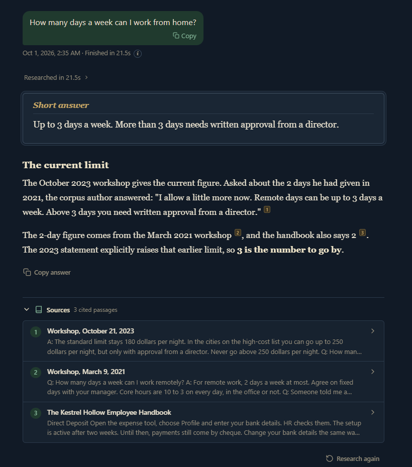

# Cited Research Assistant

Cited Research Assistant answers questions from a large private collection of documents and shows the source passage for every statement. You ask a question, it finds the passages in the library, writes an answer that cites them, and then checks the answer's quotes and numbers against those passages with plain Python. It runs on my computer, from the terminal or a web page.



My own library is private and not included. The screenshot uses `sample_corpus/`, a few short documents from a made-up company (sample data).

## What it does

- Answers only from the library. What the model already knows doesn't count as evidence.
- Plans before it searches. A planner turns the question into what the answer has to cover and a few precise fact questions.
- Maps every citation back to the exact source text and shows each passage with its source and date.
- Compares the answer's quotes, amounts and durations with the cited passages in plain Python and shows the result. The checks never rewrite the answer.
- Keeps the passages and fact questions from earlier runs in a SQLite database and reuses them in later ones.

## How it's built

- `research.py`: the whole pipeline (plan, search, answer, checks), in one large file.
- `research_memory.py`: the memory database.
- `server/` and `serve.py`: the FastAPI app. It streams progress to the browser.
- `web/`: the React and TypeScript UI, built with Vite.
- `prompts/`, `tests/`, `evals/`: one prompt per model step, the offline tests and the eval questions.

There are no API keys. The models run through the Claude Code command line (`claude -p`), and search runs through a NotebookLM notebook that holds the documents. Both use their own sign-ins. [docs/architecture.md](docs/architecture.md) follows one question through the code.

`tools/gemini_worker/worker.py` is adapted from an Apache-2.0 project (see `tools/gemini_worker/NOTICE.md`).

## Run

You can read the code, run the tests and build the web UI as it is. Asking a live question needs your own NotebookLM notebook and a signed-in `claude`.

```
python -m venv .venv
.venv\Scripts\activate            # macOS/Linux: source .venv/bin/activate
pip install -r requirements.txt
copy .env.example .env            # set CRA_NOTEBOOK_ID to your notebook
python ask.py "your question"
```

Web app:

```
cd web && npm install && npm run build && cd ..
python serve.py                   # http://127.0.0.1:8765
```

## Test

```
pip install -r requirements-dev.txt
python -m unittest discover -s tests -t .
```

99 tests, all offline. On Windows 18 of them are skipped: 15 live tests that need a signed-in `claude`, and three that need Linux or a git checkout.

I also ran the six questions in `evals/questions.json` live against the sample corpus on 2026-10-01, and 6 of 6 passed. It's one run on a small corpus, so it shows the pipeline works end to end, not how accurate it is. The scorer's table is in [docs/architecture.md](docs/architecture.md#eval-run).

## Limitations

- The number checks don't cover dollar figures, so a limit like 180 dollars per night isn't compared with the passage.
- It's a personal tool for one user. There are no accounts and no deployment, and it listens on localhost only.
- No offline test drives a whole run. The tests cover the separate steps. The full path from question to answer is only covered by the live tests and the eval run.
- Search depends on NotebookLM through an unofficial client, which can break when the service changes.

More in [docs/architecture.md](docs/architecture.md#known-limits).
